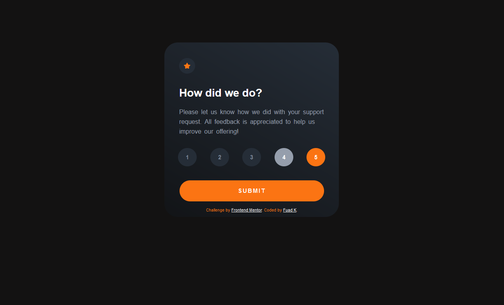
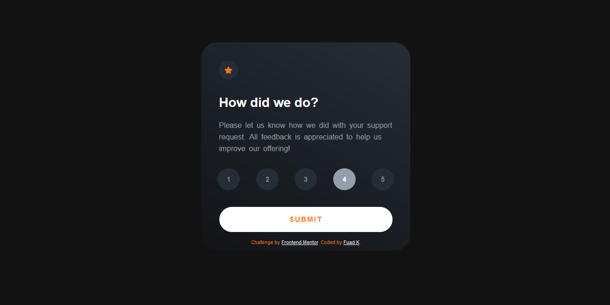
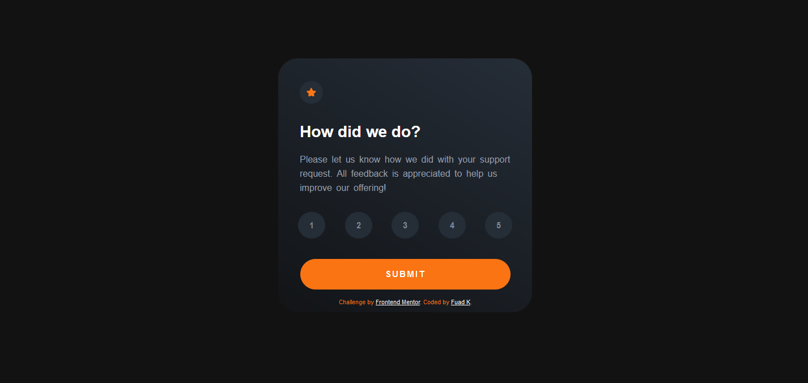
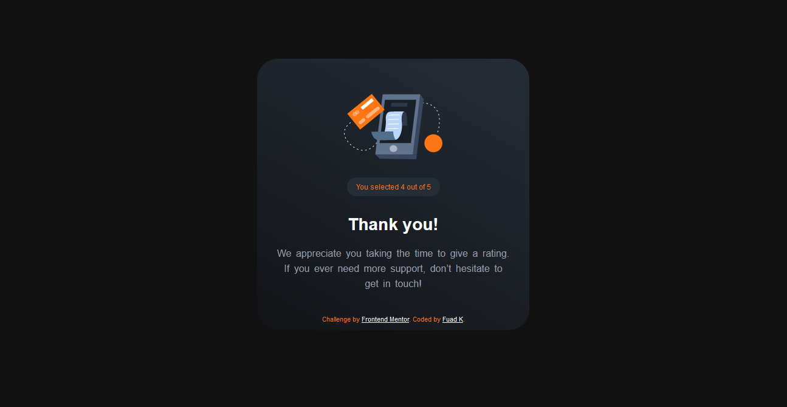
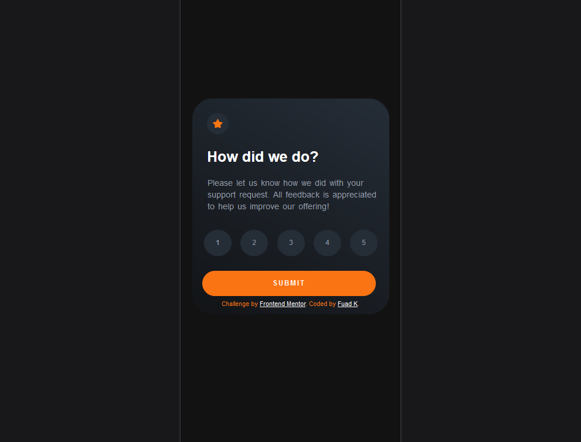
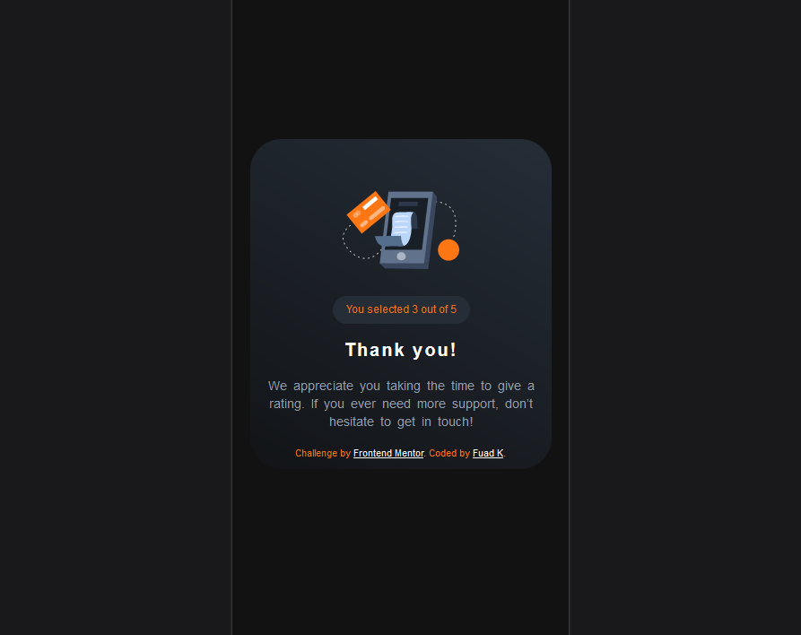

# Frontend Mentor - Interactive rating component solution

This is a solution to the [Interactive rating component challenge on Frontend Mentor](https://www.frontendmentor.io/challenges/interactive-rating-component-koxpeBUmI). Frontend Mentor challenges help you improve your coding skills by building realistic projects. 

## Table of contents

- [Overview](#overview)
  - [The challenge](#the-challenge)
  - [Screenshot](#screenshot)
  - [Links](#links)
- [My process](#my-process)
  - [Built with](#built-with)
  - [What I learned](#what-i-learned)
  - [Continued development](#continued-development)
  - [Useful resources](#useful-resources)
- [Author](#author)


## Overview

### The challenge

Users should be able to:

- View the optimal layout for the app depending on their device's screen size
- See hover states for all interactive elements on the page
- Select and submit a number rating
- See the "Thank you" card state after submitting a rating

### Screenshot








### Links

- Live Link: https://1toyosi.github.io/Interactive-Rating/

## My process

### Built with

- Semantic HTML5 markup
- CSS custom properties
- Flexbox
- CSS Grid
-Javascript


### What I learned

```css
@media screen and (max-width:...)
```

```js
buttons = Array.from(document.getElementsByClassName('btn'));
buttons.map(button => 
```


### Continued development

I will be on a watchout for projects where I have rto make use of Arrays so I can better understand the concept behind it.

I did my first responsive design in this project, never knew it was this interesting, I  look forward to making all my designs from now responsive.

### Useful resources

- [Resource 1](https://www.w3schools.com/howto/howto_js_toggle_hide_show.asp) - This helped me  learn how to change between sections or element when a button is clicked. I really liked this pattern and will use it going forward.

-[Resource 2]() I was a bit stuck when trying to convert my ratings to an Array, I came across the [Array.from()]  method, I would be making use of it in more projects now.


## Author

- Frontend Mentor -[@1toyosi](https://www.frontendmentor.io/profile/1toyosi)
- Twitter - [@oluwatoyosifuad](https://www.twitter.com/oluwatoyosifuad)

